# TradeFlow: Multi-Vendor B2B Hardware Marketplace

TradeFlow is a production-grade, full-stack, decoupled B2B marketplace engineered to streamline procurement workflows between customers and commercial hardware merchants. The platform replaces traditional single-vendor structures with a highly optimized multi-vendor ecosystem featuring distributed financial ledgers, transactional safety boundaries, real-time reactive states, and secure cryptographic verification pipelines.

---

## 🏗️ Core Architecture & System Design

TradeFlow is architected using a decoupled client-server model designed to optimize database connection pools, limit layout shifting, and guarantee ACID properties across multi-party transactions.

* **Frontend Client:** Next.js (React), Tailwind CSS, React Context API, dynamic portal injections.
* **Backend API Engine:** Node.js, Express.js (RESTful architecture), CORS-isolated routing.
* **Persistent Storage:** MongoDB Atlas via Mongoose Object Data Modeling (ODM) with strict relational schemas.
* **Payment Infrastructure:** Razorpay Standard Checkout SDK + Server-Side Webhook Event Handlers.
* **DevOps Deployment:** Vercel (Client Edge), Render (Compute Virtual Machine), Cron-job.org (Automated health-ping synchronization).

---

## 📷 System Walkthrough & UI Deep-Dive

### 1. Authentication & Onboarding
The system implements role-based access control (RBAC) separating Standard Buyers from Verified Merchants. Passwords undergo client-side transmission and are subjected to computational hashing via bcrypt on the backend before storage.

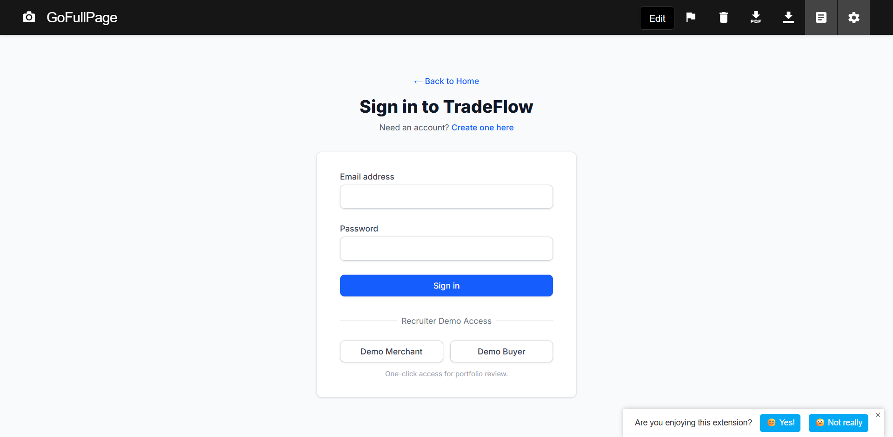
*Caption: Gateway interface enforcing token-based access tokens via secure HTTP headers.*

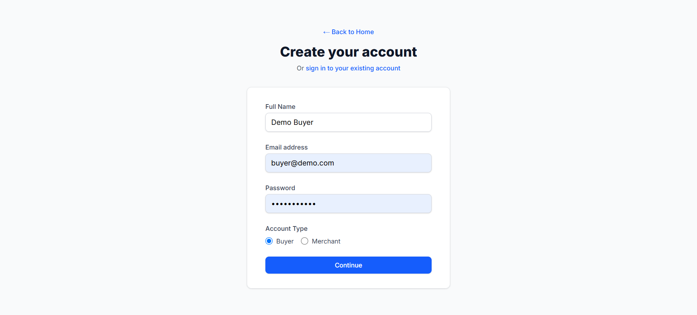
*Caption: User registration pipeline featuring role-based schema selection.*

---

### 2. The Landing Experience & Discovery Platform
Optimized for high discoverability, the landing page uses responsive layouts built with Tailwind CSS utility configurations to ensure seamless cross-device scaling.

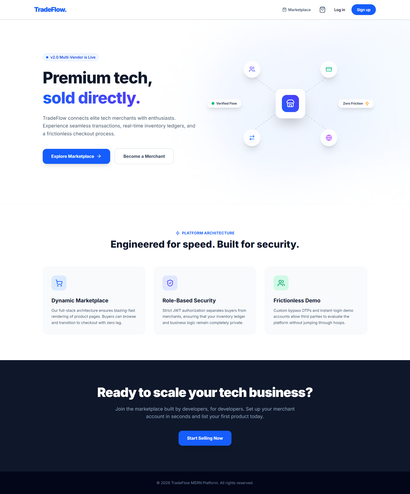
*Caption: Aggregated landing interface focusing on user acquisition pipelines.*

---

### 3. Dynamic Marketplace & Aggregated Inventories
The main procurement portal fetches documents directly from a populated MongoDB collection. It leverages server-side matching and regular expressions to support responsive search functionality.


*Caption: Material inventory interface backed by automated database query execution.*

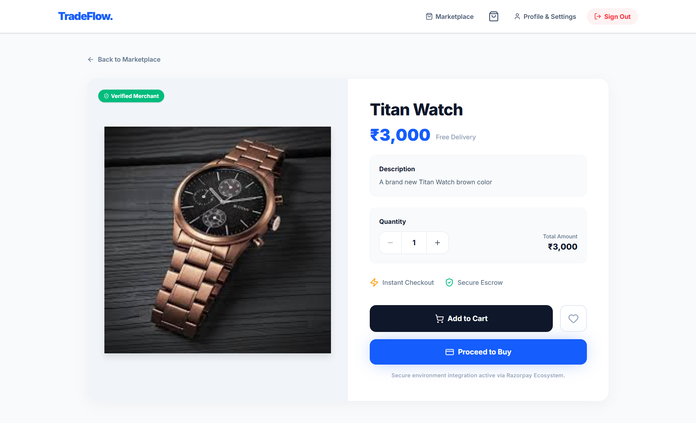
*Caption: Detailed product exposition interface featuring reactive quantity adjustment controls.*

---

### 4. Reactive State Cart Management
To bypass standard DOM tree nesting constraints and absolute positioning errors, the cart mechanism leverages a decoupled React Context engine paired with programmatic DOM portal injection points (`createPortal`).

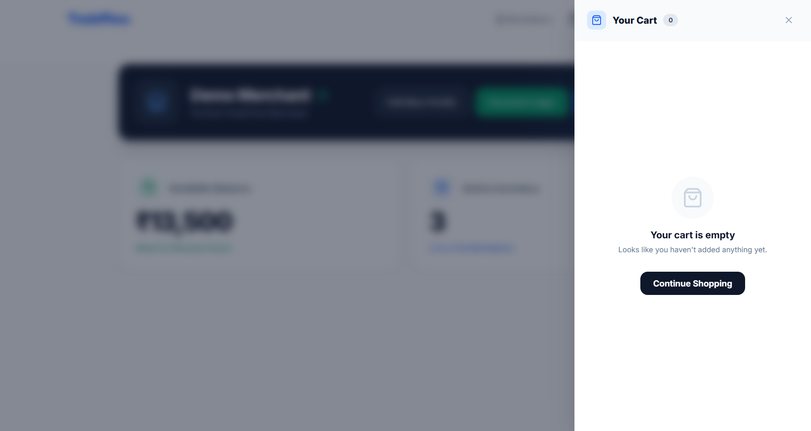
*Caption: Real-time cart overlay managing atomic mutations of structural quantities.*

---

### 5. Merchant Identity & Profile Control
Merchants retain granular data governance over corporate identities, localized metadata, and performance metrics through automated validation controllers.

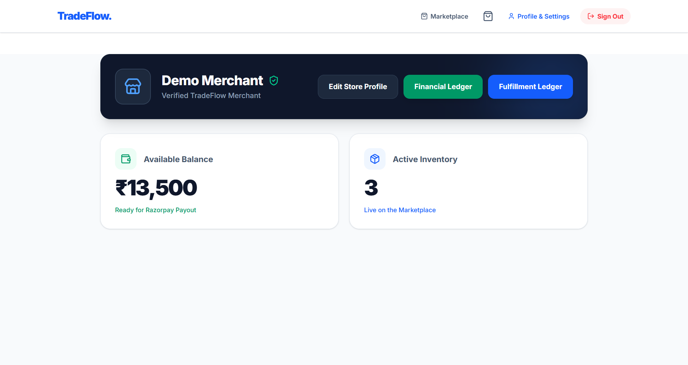
*Caption: Vendor administrative space tracking active merchant specific telemetry.*

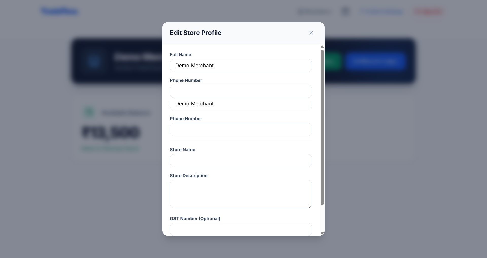
*Caption: Data persistence update dashboard with structural schema validation.*

---

### 6. The Razorpay Transaction Engine
The order checkout workflow initiates a secure checkout process via the client-side SDK, establishing a pending transactional state within the application backend.

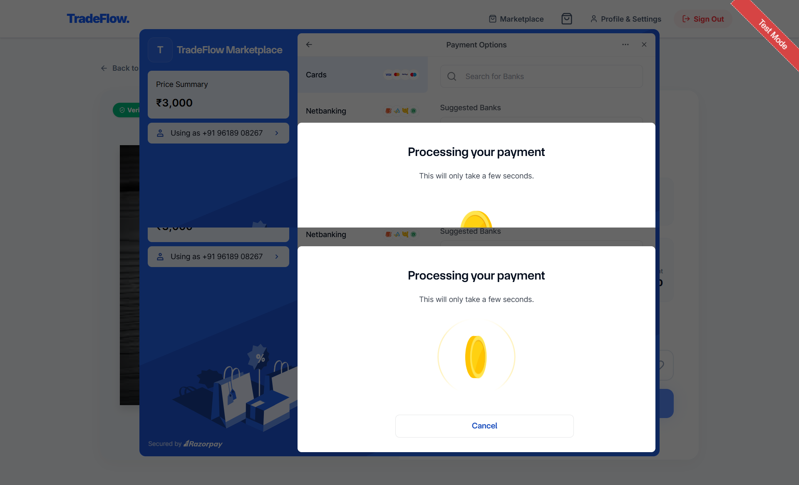
*Caption: Sandbox runtime execution of secure multi-party tokenized card intake.*

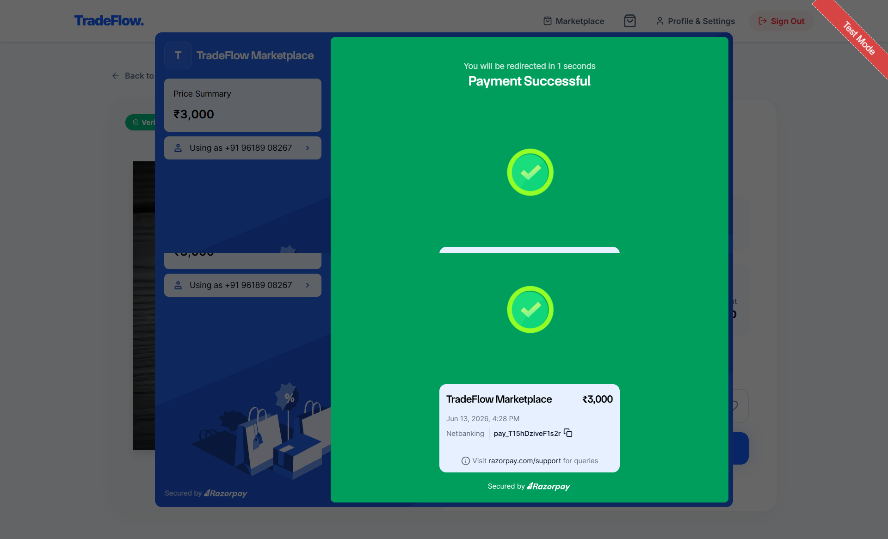
*Caption: Synchronous transaction resolution state parsing successful gateway responses.*

---

### 7. Multi-Party Split Financial Ledgers
Upon successful receipt of a verified payment, the backend isolates vendor metrics and calculates automated fee distributions using non-blocking asynchronous updates.

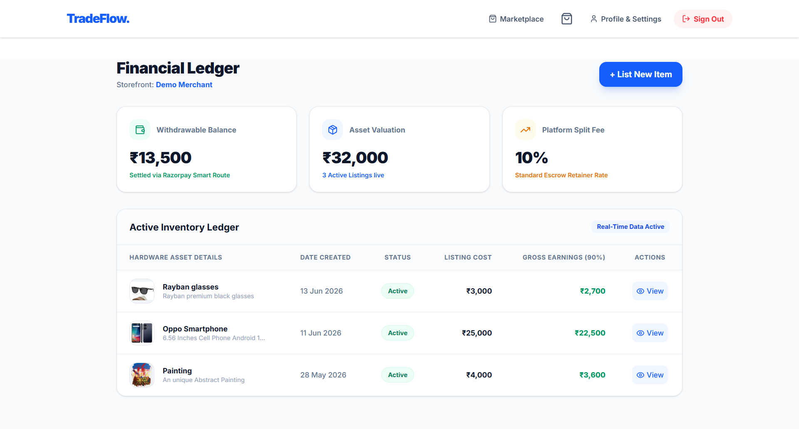
*Caption: Automated ledger distributing 90% platform earnings to merchant balances.*

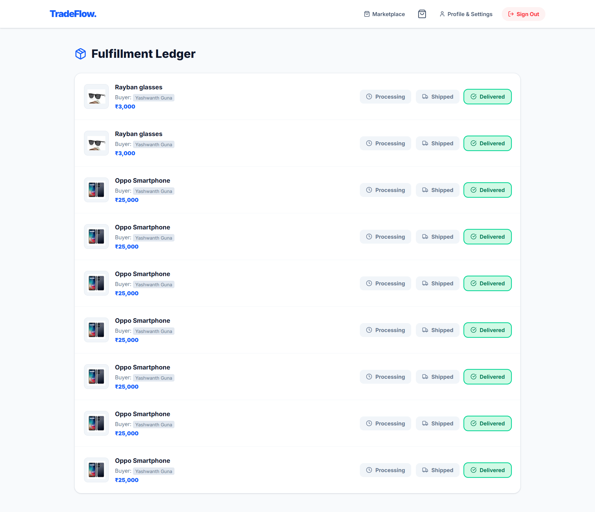
*Caption: Granular auditing interface keeping record of order distribution status.*

---

## 🛠️ Key Technical Achievements

* **Automated Split-Payment Ledger Engine:** Engineered an atomic database layer that catches transaction flags and dynamically splits order capital: assigning a strict 10% platform facilitation fee to central admin balances while channeling the remaining 90% directly into the verified vendor's internal wallet via MongoDB `$inc` operators.
* **Cryptographic Webhook Verification:** Implemented a secure backend listener utilizing SHA-256 HMAC cryptographic hashes. The server validates incoming webhook requests using standard buffers to verify authenticity from Razorpay's edge, entirely neutralizing API spoofing vectors.
* **Trapped-Context Resolution:** Resolved standard nested UI rendering errors by implementing React Portals. This strategy decouples the slide-out navigation overlay from localized wrapper elements, mounting elements directly to the document root node for stable rendering.
* **DevOps High-Availability Sync:** Mitigated cold-start latency patterns associated with server virtualization on the cloud free-tier. Built a remote cron orchestration routine targeting accessible status-reporting routes (`/api/products`) every 10 minutes, generating structural HTTP status codes that preserve host availability.

---

## ⚙️ Environment Variables Configuration

To spin up this project locally, ensure you maintain two separate configuration environments mapping variables exactly as described below:

### Backend Engine Environment (`/server/.env`)
| Variable Key | Expected Value / Type | Purpose |
| :--- | :--- | :--- |
| `MONGO_URI` | `mongodb+srv://...` | Secure cloud database connection pool token |
| `JWT_SECRET` | `String (Cryptographic)` | Key used for generating role-based access tokens |
| `RAZORPAY_KEY_ID` | `String (Public)` | Public identifier required for Razorpay SDK calls |
| `RAZORPAY_KEY_SECRET` | `String (Private)` | Secret used to sign backend settlement orders |
| `RAZORPAY_WEBHOOK_SECRET` | `String (Private)` | Local hash verifying incoming webhook signatures |

### Frontend Client Environment (`/client/.env`)
| Variable Key | Expected Value / Type | Purpose |
| :--- | :--- | :--- |
| `NEXT_PUBLIC_API_BASE_URL` | `https://...` | Target root address pointing to your live backend engine |
| `NEXT_PUBLIC_RAZORPAY_KEY_ID` | `rzp_test_...` | Public client token used to initialize checkout sheets |

---

## 🚀 Local Installation & Execution

Follow these step-by-step instructions to mirror the system within a local testing container.

```bash
# 1. Clone the master repository branch
git clone [https://github.com/yourusername/TradeFlow.git](https://github.com/yourusername/TradeFlow.git)
cd TradeFlow

# 2. Initialize and spin up the Backend API Engine
cd server
npm install
npm run dev

# 3. Initialize and spin up the Frontend Next.js Client (Open a separate terminal window)
cd ../client
npm install
npm run dev